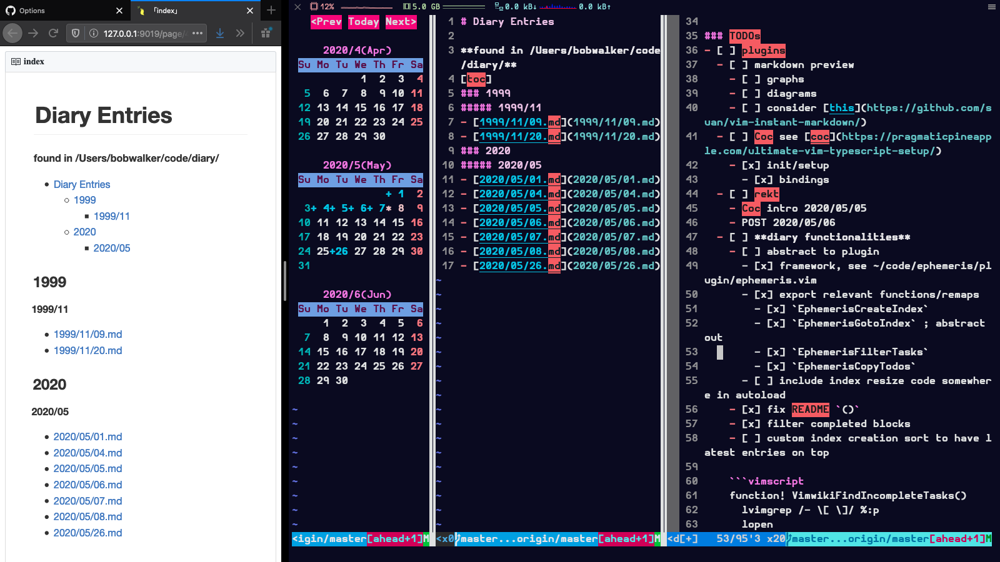

# ephemeris
! experimental and unstable see [BUGS](#bugs)
> a diary plugin for vim

ephemeris is a diary and calendar extension plugin for vim. It provides a
collection of functions and commands that can be used to create, edit, and
curate diary/log entries.

The diary is defined by the directories and files found recursively under the
directory set in the global variable |g:ephemeris_diary|. ephemeris does not
rely on any external programs and does not interfere with any external
program, such as cal, etc. This plugin works best when the directory structure
of `g:ephemeris_diary` is YYYY/MM/DD.md, as follows:
```txt
  ├── 2019
  │   └── 09
  │       ├── 16.md
  │   └── 12
  │       └── 20.md
  ├── 2020
  │   └── 05
  │       ├── 01.md
  │       ├── 04.md
```
This tree structure is provided by default by ephemeris functions. This plugin
will only provide limited functionality if the directory structure does not
include a date-aligned directory structure as outlined above.



**see [doc/ephemeris.txt](doc/ephemeris.txt) for additional user help**

**see [CONTRIBUTING](.github/CONTRIBUTING.md) for contributor guidelines**

**see [vader tests](.github/CONTRIBUTING.md#vader-tests) for testing
documentation**

version information available at [vim.org](https://www.vim.org/scripts/script.php?script_id=5879)

### BUGS
- prior to v0.4 :EphemerisCopyTodos, if called from outside `g:calendar_diary`,
  when `g:calendar_diary` contained a `~`, created a `g:calendar_diary/~/...`
  subdirectory, and possibly other things. please accept my apologies. the fix
  is documented in
  [85bb3bf59ec379755fd8270994796e7c1fe32c8c](https://github.com/HP4k1h5/ephemeris/commit/85bb3bf59ec379755fd8270994796e7c1fe32c8c)

---------------------------------------------
## contents

[toc]

---------------------------------------------
#### functionalities

- create/goto **index** of diary entries
- **checkbox** list item management
  - filter/toggle/(...in progress: sort/aggregate/calculate)
  - copy last set of tasks `- [ ]` to current day's diary entry

### ! required

set the root directory for your diary entries `g:ephemeris_diary`, i.e. in your
`.vimrc`:
```vim
let g:ephemeris_diary = '~/diary'
```

###### optional

set the string for `EphemerisCopyTodos`, to look for.  default is `TODOs`.
Everything below the marker in the most recent diary entry is copied and
appended into the current day's entry. You can change it by setting it, i.e.
in your `.vimrc`
```vim
let g:ephemeris_todos = '=== TASK LIST ==='
```
See `EphemerisCopyTodos`

---------------------------------------------
#### installation

should work with your preferred vim plugin manager. e.g. add
```vim
Plug 'HP4k1h5/ephemeris'
Plug 'mattn/calendar-vim' " recommended
```
to your `.vimrc` and run
```vim
:source $MYVIMRC | PlugInstall
```
in command-line mode (see `:help cmdline`)

##### optional-but-helpful
- [vim-calendar
    /https://github.com/mattn/calendar-vim](https://github.com/mattn/calendar-vim)
- [markdown-preview](https://github.com/iamcco/markdown-preview.nvim)
    or your preferred markdown preview / syntax highlighter tool

---------------------------------------------
### usage

Call any of ephemeris' commands from anywhere. `:EphemerisFilterTasks`
and `:EphemerisToggleTask` will operate on the currently active buffer.
Otherwise all functions are buffer agnostic and should work anywhere. see
functions below...

#### commands
**see [doc/ephemeris.txt](doc/ephemeris.txt) for additional help**

*:EphemerisCreateIndex*  
Create markdown diary index of all '.md' files found under the
|g:ephemeris_diary| directory, and go to vertical split. Calls
|ephemeris#ind#create_index()|

*:EphemerisGotoIndex*  
Open diary index in a vertical split or focus diary index buffer. Index is
found at |g:ephemeris_diary|/index.md. Calls |ephemeris#ind#goto_index()|

*:EphemerisCopyTodos*  
Look backwards through previous entries for last |g:ephemeris_todos| marker,
as defined by the tasks found below the string.  Calls
|ephemeris#lst#copy_todos()|

*:EphemerisFilterTasks*  Delete completed tasks, e.g. list items containing `-
[x]`, and all associated subblocks until the next incomplete task, e.g. list
items containing `- [ ]`, a |g:ephemeris_todos| marker, 2 newlines, or EOF.
See example in |ephemeris#lst#filter_tasks()|.
```md
*------------------------------------*
| TODOs (before)                     |
|- [x] complete task 1               |
|- [ ] incomplete task 2             |
|  - [x] complete task 2a            |
|  - additional info that is not a   |    run in command-line mode
| task will be preserved if the      |  *---------------------*
| task is incomplete                 |--|:EphemerisFilterTasks|
|- [x] complete task 3               |  *---------------------*
|  - [ ] incomplete task 3a          |              |
|- [x] complete task 4               |              |
|  - but removed otherwise           |              |
|  - [ ] incomplete task 4a also     |              |
|   this will get preserved          |              |
*------------------------------------*              V
            *----------------------------------------------*
            | TODOs  (after)                               |
            |- [ ] incomplete task 2                       |
            |- [ ] incomplete task 3a                      |
            |- [ ] incomplete task 4a also                 |
            |  this will get preserved                     |
            *----------------------------------------------*
```

*:EphemerisToggleTask*  
Toggles the state of a task found on the same line as the cursor between
```txt
    - [ ] incomplete
      and
    - [x] complete
```
will not affect the state of any other tasks. Calls
|ephemeris#lst#toggle_task()|

#### example-mappings

```vim
nmap <leader>eci :EphemerisCreateIndex<CR>
nmap <leader>egi :EphemerisGotoIndex<CR>
nmap <leader>ect :EphemerisCopyTodos<CR>
nmap <leader>eft :EphemerisFilterTasks<CR>
nmap <leader>et  :EphemerisToggleTask<CR>
```

##### consider

```vim
" keeps index properly sized
au BufEnter g:calendar_diary :vertical resize 38
```
