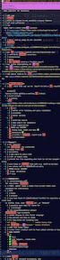
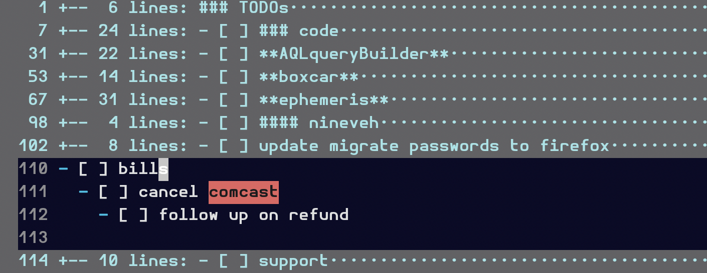

# ephemeris
! experimental and unstable see [BUGS](#bugs)
> a diary plugin for vim

ephemeris is a diary and calendar extension plugin for vim. It provides a
collection of functions and commands that can be used to create, edit, and
curate diary/log entries.

The diary is defined by the directories and files found recursively under the
directory set in the global variable |g:ephemeris_diary|. ephemeris does not
rely on any external programs and does not interfere with any external
program, such as cal, etc. This plugin works best when the directory structure
of `g:ephemeris_diary` is YYYY/MM/DD.md, as follows:
```txt
  ├── 2019
  │   └── 09
  │       ├── 16.md
  │   └── 12
  │       └── 20.md
  ├── 2020
  │   └── 05
  │       ├── 01.md
  │       ├── 04.md
```
This tree structure is provided by default by ephemeris functions. This plugin
will only provide limited functionality if the directory structure does not
include a date-aligned directory structure as outlined above.


**see [doc/ephemeris.txt](doc/ephemeris.txt) for additional user help**  
**see [CONTRIBUTING](.github/CONTRIBUTING.md) for contributor guidelines**  
**see [vader tests](.github/CONTRIBUTING.md#vader-tests) for testing
documentation**

version information available at [vim.org](https://www.vim.org/scripts/script.php?script_id=5879)

---------------------------------------------

## contents

- [functionalities](#functionalities)
- [options](#options)
    - [! required](#!-required)
- [installation](#installation)
- [usage](#usage)
- [commands](#commands)
  - [code folding](#code-folding)
- [example-mappings](#example-mappings)
- [CHANGELOG](#changelog)

---------------------------------------------

#### functionalities

 - 🌕 create/goto **index** of diary entries
 - 🌘 **checkbox** list item management
   - 🌓 filter/toggle/archive/count
   - 🌖 copy last set of tasks `- [ ]` to current day's diary entry
 - 🌘 list-appropriate code folding


#### options

###### ! required

**g:ephemeris_diary**  
set the root directory for your diary entries `g:ephemeris_diary`, i.e. in your

`.vimrc`:
```vim
let g:ephemeris_diary = '~/diary'
```

**g:ephemeris_todos**  
Set the string for `EphemerisCopyTodos`, to look for. Default is `TODOs`.
Everything below the marker in the most recent diary entry is copied and
appended into the current day's entry. You can change it by setting it, i.e.
in your `.vimrc`. See `EphemerisCopyTodos`.
Example:  
```vim
let g:ephemeris_todos = '=== TASK LIST ==='
```

**g:ephemeris_todo_list**  
Set the list of string that will be counted as checkbox items.
Example:  
```vim
let g:ephemeris_toggle_list = [ '- 🌑', '- 🌘', '- 🌓', '- 🌖', '- 🌕' ]
```

optional-but-helpful
- [mattn/vim-calendar
    /https://github.com/mattn/calendar-vim](https://github.com/mattn/calendar-vim)
- [iamcco/markdown-preview](https://github.com/iamcco/markdown-preview.nvim)
    or your preferred markdown preview / syntax highlighter tool
- [plasticboy/vim-markdown](https://github.com/plasticboy/vim-markdown)

---------------------------------------------

#### installation

should work with your preferred vim plugin manager. e.g. add
```vim
Plug 'HP4k1h5/ephemeris'
Plug 'mattn/calendar-vim' " recommended
```
to your `.vimrc` and run
```vim
:source $MYVIMRC | PlugInstall
```
in command-line mode (see `:help cmdline`)

---------------------------------------------

### usage

Call any of ephemeris' commands from anywhere. `:EphemerisFilterTasks`
and `:EphemerisToggleTask` will operate on the currently active buffer.
Otherwise all functions are buffer agnostic and should work anywhere. see
functions below...

#### commands
**see [doc/ephemeris.txt](doc/ephemeris.txt) for additional help**

**:EphemerisCreateIndex**  
Create markdown diary index of all '.md' files found under the
|g:ephemeris_diary| directory, and go to vertical split.  Calls
|ephemeris#ind#create_index()|

**:EphemerisGotoIndex**  
Open diary index in a vertical split or focus diary index buffer. Index is
found at |g:ephemeris_diary|/index.md. Calls |ephemeris#ind#goto_index()|

**:EphemerisGotoToday**  
Open a split with today's diary entry. Index is found at
|g:ephemeris_diary|/index.md.

**:EphemerisCopyTodos**  
 Copy TODOs from last set of TODOs going back up to 10 years. Your
 @setting(g:ephemeris_diary) directory must  be organized in a
 `.../YYYY/MM/DD.md` hierarchy, in order for this function to know which set
 of TODOs are _most recent_. TODOs are defined by the string set in
 @setting(g:ephemeris_todos). Default is 'TODOs'. Everything below that
 marker, until 2 consecutive newlines, an incomplete task, or a subsequent
 g:ephemeris_todos marker, is copied to the current day's diary entry. It will
 open today's diary entry in a split. Calls
 @function(ephemeris#lst#copy_todos)

**:EphemerisFilterTasks**  
 @usage [archive] [summary]  
 Delete completed tasks, e.g. list items containing `- [x]`, and all associated
 subblocks until the next incomplete task, e.g. checkboxes not containing an 'x',
 a @setting(g:ephemeris_todos) marker, 2 newlines, or EOF. See example in
 @function(ephemeris#lst#filter_tasks). The first argument [archive] is a
 boolean which determines whether the filtered tasks are moved to
 'g:ephemeris_diary'/.cache/archive.md. Default is 0. The second argument
 [summary] is a boolean. If true this function will print a summary of
 filtered/remaining tasks at the bottom of the buffer. Default is 0.  
 Ex: `:EphemerisFilterTasks 1 1` " filters tasks, moves completed tasks to


```md
*------------------------------------*
| TODOs (before)                     |
|- [x] complete task 1               |
|- [ ] incomplete task 2             |
|  - [x] complete task 2a            |
|  - additional info that is not a   |    run in command-line mode
| task will be preserved if the      |  *---------------------*
| task is incomplete                 |--|:EphemerisFilterTasks|
|- [x] complete task 3               |  *---------------------*
|  - [ ] incomplete task 3a          |              |
|- [x] complete task 4               |              |
|  - but removed otherwise           |              |
|  - [ ] incomplete task 4a also     |              |
|   this will get preserved          |              |
*------------------------------------*              V
            *----------------------------------------------*
            | TODOs  (after)                               |
            |- [ ] incomplete task 2                       |
            |  - [ ] incomplete task 3a                    |
            |  - [ ] incomplete task 4a also               |
            |   this will get preserved                    |
            *----------------------------------------------*
```

**:EphemerisFold**  
 Fold file by line-separated paragraphs, works well with lists if you leave a
 " space between list blocks. Set 'foldlevel' to 0 or type `zM` to fold all,
 type " `zR` to open all folds.

### code folding

In the top left image, an unfolded list of items.  As these grow, navigating
them and getting a high-level overview can be difficult. In the top right
image, code-folding has been applied and all blocks have been closed `zM`.
Blocks of newline-spaced list items are folded and visually condensed to their
parent headers. In the bottom image, one fold has been opened `zo`.

  


___
**:EphemerisToggleTask**  
Toggles the state of a task found on the same line as the cursor through
strings set at `g:ephemeris_todos`
```txt
    - [ ] incomplete
      and
    - [x] complete
```
will not affect the state of any other tasks. Calls
|ephemeris#lst#toggle_task()|

#### example-mappings

```vim
nmap <leader>eci :EphemerisCreateIndex<CR>
nmap <leader>egt :EphemerisGotoToday<CR>
nmap <leader>ect :EphemerisCopyTodos<CR>
nmap <leader>ef  :EphemerisFold<CR>
nmap <leader>eft :EphemerisFilterTasks 1 1<CR>
"          1 = archive, 0 = delete ---^ ^---- 1 = summary, 0 = no summary
nmap <leader>et  :EphemerisToggleTask<CR>
```

### CHANGELOG

- v0.8 folding, checkbox options
